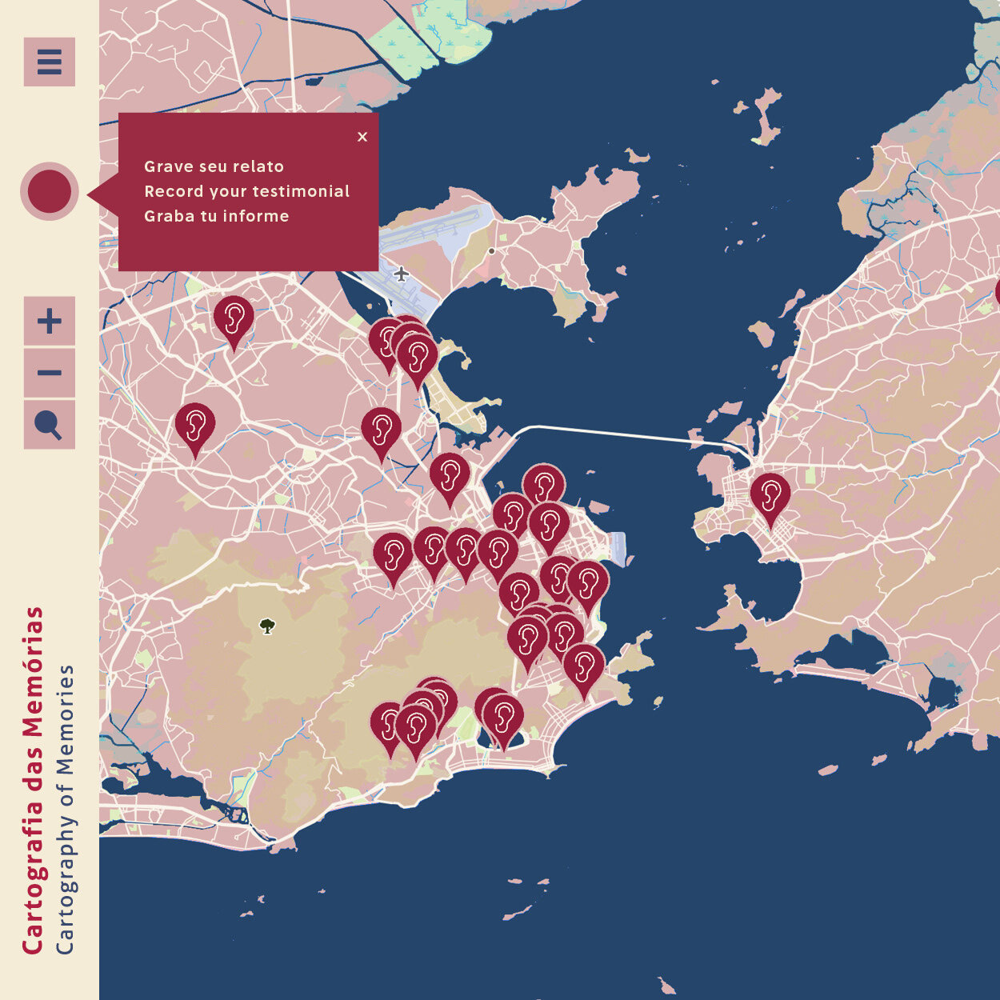

 

[cartografiadasmemorias.org/](https://cartografiadasmemorias.org/en){:target="_blank"}
 

--- 

Este mapa sonoro é uma iniciativa colaborativa que busca registrar e preservar, através de relatos orais, memórias de vivências pessoais durante a pandemia da Covid-19, iniciada em 2020. Você pode colaborar com o envio de seu relato e também com o compartilhamento do projeto em suas redes.
 
Desejamos alcançar o maior número e diversidade de relatos possíveis para formar um panorama heterogêneo de pontos de vistas sobre este evento de escala mundial.
O projeto foi criado por um grupo formado por historiadores, cientistas, artistas, comunicadores, desenvolvedores, artistas, comunicadores, desenvolvedores, educadores e divulgadores. Estes profissionais se reuniram através do Laboratório de Emergência | Covid–19 para trabalharem juntos em alternativas solidárias.

Este projeto é apoiado por uma doação da Open Society Foundations, gerenciada pelo Centro de Direitos Humanos Aplicados – Universidade de York (Reino Unido) [Arte + Ativismo Contra Repressão Durante a Crise de Covid-19](https://www.hrdhub.org/arctivism){:target="_blank"}.