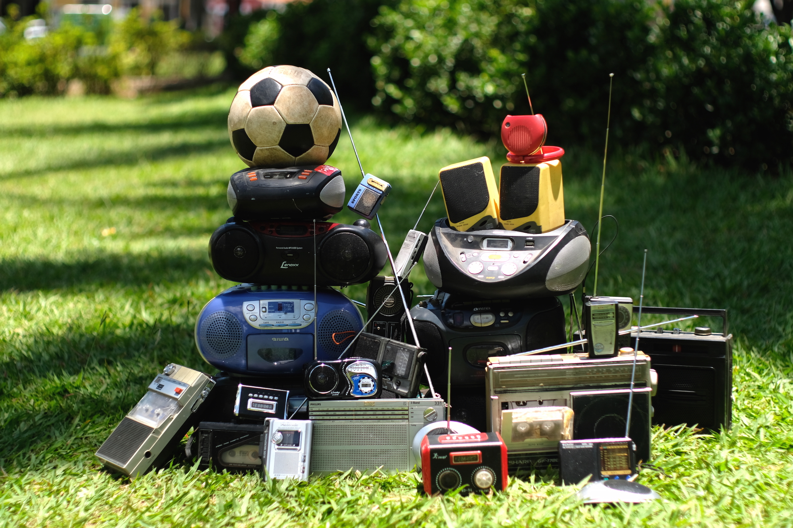

  

On July 15, 2018, over the course of 90 minutes, a big part of the planet followed the FIFA’s World Cup final tournament. We recorded around 60 radio broadcasters from all over the world which all commented on the match each in their own way: in Ghana, Mali, Brazil, Argentina, Poland, Thailand, Bangladesh, Indonesia, Morocco, among others.

Through the sound-based coverage of one of the planet’s biggest events the act of listening unites people and brings us together in a global sense, but also gives us the opportunity to identify our cultural differences. For example, during half-time, some radio broadcasters interrupt the match with advertisements, while others have prayer calls, personal dedications, the local hour announcement, or simple bombarding listeners with jingles and music.

In global and mostly visual times, when we are connected through a small screen and the internet, listening to the radio seems like an old-fashioned practice, but for soccer lovers the commentator is still a relevant and an important character in their lives. This sound collage invites us to listen to a story of which we all know the end through a variety of languages, accents, rhythms and melodies within a background of crackling and saturation, very common sounds in radio broadcasts.
 

---

 

   <iframe width="100%" height="166" scrolling="no" frameborder="no" allow="autoplay" src="https://w.soundcloud.com/player/?url=https%3A//api.soundcloud.com/tracks/547674996&color=%232057b5&auto_play=false&hide_related=false&show_comments=true&show_user=true&show_reposts=false&show_teaser=true"></iframe>

