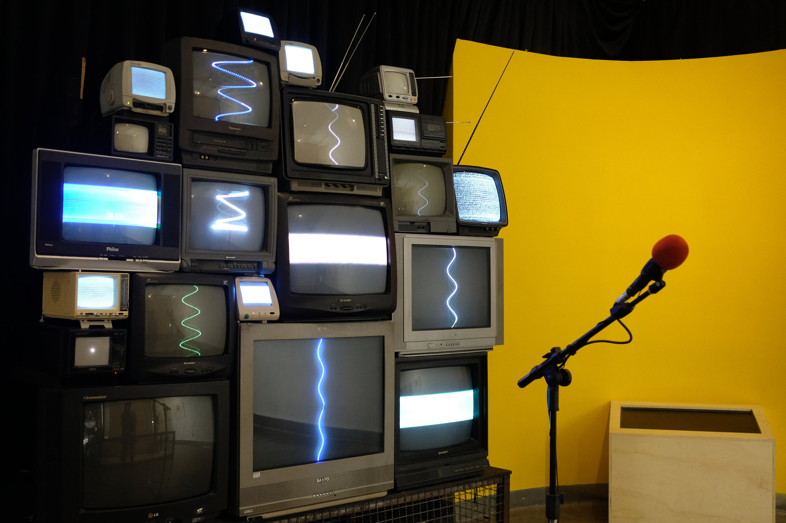

  

Um microfone grava frases faladas e um sistema troca cada uma das palavras enunciadas por seu antônimo.
A frase invertida é propagada por uma parede de alto-falantes coletados de sucatas de objetos obsoletos.
Velhas mídias que reverberam o oposto do que queremos dizer.
 

Com a colaboração de Thiago Hersan 
 

--- 

 
 

  

        

            <iframe src="https://player.vimeo.com/video/329192060?title=0&byline=0&portrait=0" width="640" height="360" frameborder="0" allow="autoplay; fullscreen" allowfullscreen></iframe>
        

   

    

        

            <iframe src="https://player.vimeo.com/video/329221721?title=0&byline=0&portrait=0" width="640" height="360" frameborder="0" allow="autoplay; fullscreen" allowfullscreen></iframe>
        

    

 
 

--- 

 