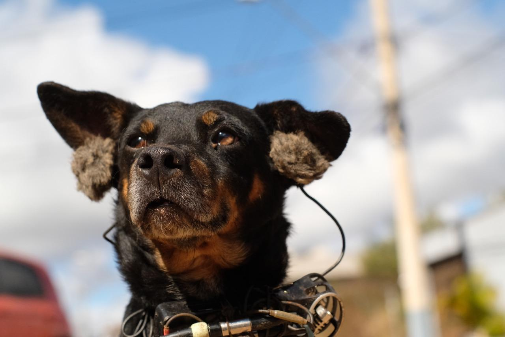

  

  

   <iframe width="100%" height="166" scrolling="no" frameborder="no" allow="autoplay" src="https://w.soundcloud.com/player/?url=https%3A//api.soundcloud.com/tracks/382080137&color=%23ffb800&auto_play=false&hide_related=false&show_comments=true&show_user=true&show_reposts=false&show_teaser=true"></iframe>

 
Cães de rua compartilham a escuta de seu mundo canino em coabitação com os humanos. Nós, cachorros, adoramos fuçar o lixo à procura de algo para comer, latir para as motos que passam, correr atrás dos automóveis que invadem nosso território, nos meter dentro das casas dos humanos e explorar terrenos abandonados. Uma peça ao nível do chão, gravada em binaurais por vira-latas de bairros recentemente urbanizados, nas cercanias de Belo Horizonte.

**Realização:** Sara Lana et Félix Blume 
**Produção:** Arte Radio 
**Gravações:** Marmita, Pretinha, Nina, Bob e Frida 
**Difusão:** Arte Radio, Centre Pompidou (Paris), Maison de la Poésie (Paris), [Radio Campus Bruxelles (Belgium)](https://www.mixcloud.com/radiocampusbruxelles/le-matin-du-vendredi-aka-lemission-19022018/){:target="_blank"}, Bruits Festival Audioscénique (Nantes), Rádio Raio 
**Press:** [RTBF “Le docu qui a du chien”](https://www.rtbf.be/culture/pop-up/culture-web/detail_mutt-dogs-le-docu-qui-a-du-chien?id=9813632){:target="_blank"}

[Avant-Première 16 Novembro 2017 no Centre Pompidou](https://www.centrepompidou.fr/cpv/resource/crEn9k7/rXEnG8r){:target="_blank"}
