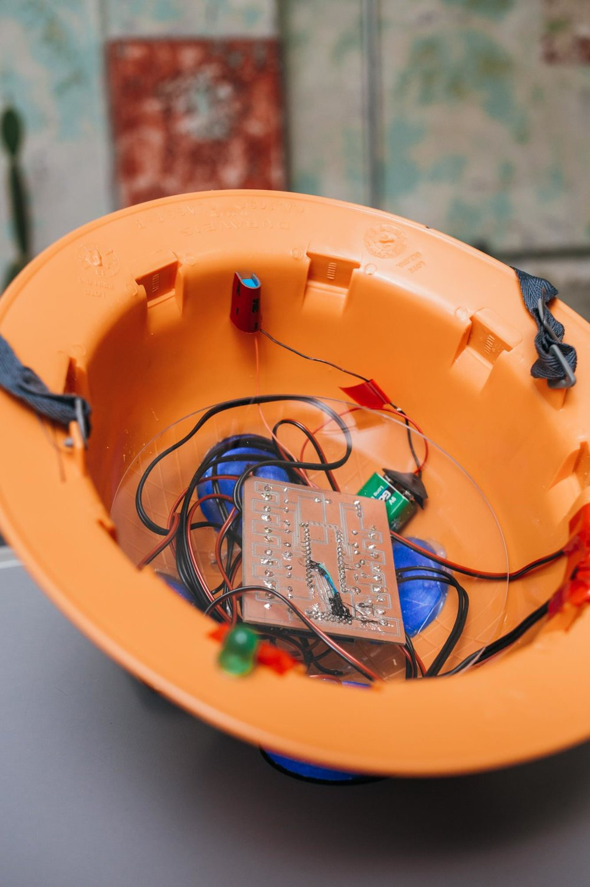

    <iframe src="https://www.youtube.com/embed/bECVsfDJvQI" frameborder="0" allow="accelerometer; clipboard-write; encrypted-media; gyroscope; picture-in-picture" allowfullscreen></iframe>

 
  
**TACTICS OF VISIBILITY** 

Hack security cameras and reveal those devices increasingly discreets and camouflaged in the cityscapes.

A helmet capable of automatically detect security cameras and reveal to its user when she/he is being shot. The device is also equipped with a GPS: when a camera is detected, its coordinates are recorded and stored on a map.
 

  

    
  

  

    
  

   
 
**TACTICS OF INVISIBILITY - IN PROCESS**

Development of a route plotter that allows you to trace routes from a point A to a point B of a city passing only through the blind spots of security cameras.

Creation of tools for bluring images recorded by video surveillance cameras.

  

    
  

  

    
  

  

---

    <iframe src="https://player.vimeo.com/video/232335840" width="640" height="360" frameborder="0" allow="autoplay; fullscreen" allowfullscreen></iframe>

 

---

 
### MAP

  

    <iframe frameBorder="0" src="https://umap.openstreetmap.fr/en/map/pontos-cegos_102015?scaleControl=false&miniMap=false&scrollWheelZoom=false&zoomControl=true&allowEdit=false&moreControl=true&searchControl=null&tilelayersControl=null&embedControl=null&datalayersControl=true&onLoadPanel=undefined&captionBar=false"></iframe>
<a href="https://umap.openstreetmap.fr/en/map/pontos-cegos_102015">See full screen</a>

  

  
  

---

 
  
### DIY | DEVICE

[github (codes, pcb e etc)](https://github.com/saralana/Pontos-Cegos){:target="_blank"}
  
[download](../assets/docs/tutorial-pontos-cegos.pdf){:target="_blank"} a brief tutorial

 

---

 

### COLLABORATE

Collaborate via Telegram, sharing the camera location with @PontosCegosBot

  

    
  

  

    
  

 

---

 