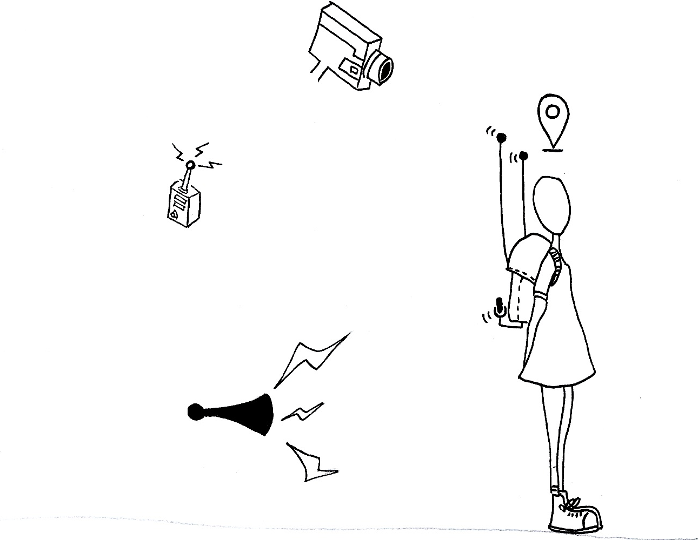

**Sara Lana** 

2016 _ São Paulo  
2018 _ Ciudad de México

**TÁTICAS DE (IN)VISIBILIDADE** para hackear câmeras de seguranças e revelar esses aparatos cada vez mais discretos e já camuflados nas cidades.
Trata-se de um capacete capaz de detectar automáticamente câmeras de segurança e indicar ao seu usuário quando ele está sendo filmado.
O aparato criado é também dotado de um GPS e ao detectar uma câmera, suas coordenadas são registradas e armazenadas em um **mapa**.

**in process**
 **. táticas do invisível**
 _ desenvolvimento de um traçador de rotas que permite criar caminhos de um ponto A a um ponto B de uma cidade passando apenas pelos pontos cegos de suas câmeras.
 _  criação de ferramentas capazes de apagar as imagens registradas por vídeo-vigilância.

 
 
  
---

### > VÍDEO <

  <iframe src="https://player.vimeo.com/video/165527282?byline=0&amp;portrait=0" frameborder="0" allowfullscreen="allowfullscreen"></iframe>

---
 
### > MAPA <

  

    <iframe frameBorder="0" src="https://umap.openstreetmap.fr/en/map/pontos-cegos_102015?scaleControl=false&miniMap=false&scrollWheelZoom=false&zoomControl=true&allowEdit=false&moreControl=true&searchControl=null&tilelayersControl=null&embedControl=null&datalayersControl=true&onLoadPanel=undefined&captionBar=false"></iframe>
<a href="https://umap.openstreetmap.fr/en/map/pontos-cegos_102015">See full screen</a>

  

---
 
### > CONSTRUA SEU APARATO <

---
 
### > COLABORE <

---
 
