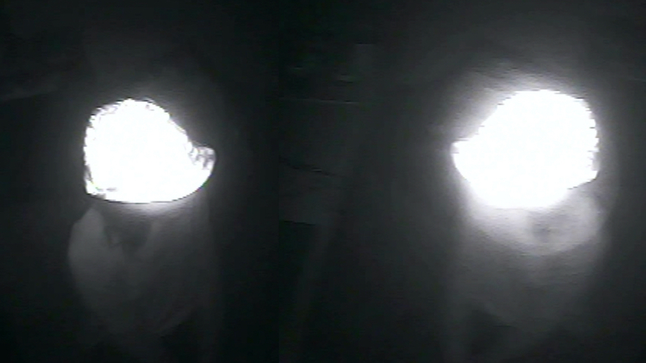

    <iframe src="https://www.youtube.com/embed/bECVsfDJvQI" frameborder="0" allow="accelerometer; clipboard-write; encrypted-media; gyroscope; picture-in-picture" allowfullscreen></iframe>

 
  
**TÁTICAS DE VISIBILIDADE** 
 para hackear câmeras de seguranças e revelar esses aparatos cada vez mais discretos e já camuflados nas cidades.
Trata-se de um capacete capaz de detectar automáticamente câmeras de segurança e indicar ao seu usuário quando ele está sendo filmado.
O aparato criado é também dotado de um GPS e ao detectar uma câmera, suas coordenadas são registradas e armazenadas em um **mapa**.
  

  

    
  

  

    
  

 
 **TÁTICAS DE INVISIBILIDADE | EM ANDAMENTO**
 _ desenvolvimento de um traçador de rotas que permite criar caminhos de um ponto A a um ponto B de uma cidade passando apenas pelos pontos cegos de suas câmeras.
 _  criação de ferramentas capazes de apagar as imagens registradas por vídeo-vigilância.
  

  

    
  

  

    
  

  

---

 

### VÍDEO

    <iframe src="https://player.vimeo.com/video/232335840" width="640" height="360" frameborder="0" allow="autoplay; fullscreen" allowfullscreen></iframe>

 

---

 

### MAPA

  

    <iframe frameBorder="0" src="https://umap.openstreetmap.fr/en/map/pontos-cegos_102015?scaleControl=false&miniMap=false&scrollWheelZoom=false&zoomControl=true&allowEdit=false&moreControl=true&searchControl=null&tilelayersControl=null&embedControl=null&datalayersControl=true&onLoadPanel=undefined&captionBar=false"></iframe>
<a href="https://umap.openstreetmap.fr/en/map/pontos-cegos_102015">See full screen</a>

  

  

---

 

### CONSTRUA SEU APARATO

[projeto no github (códigos, pcb e etc)](https://github.com/saralana/Pontos-Cegos){:target="_blank"}
  
[baixe aqui](../assets/docs/tutorial-pontoscegos.pdf){:target="_blank"} o passo-a-passo resumido 

 

---

 

### COLABORE 
Colabore via Telegram, compartilhando sua localização com o BOT @PontosCegosBot

  

    
  

  

    
  

 

---

 