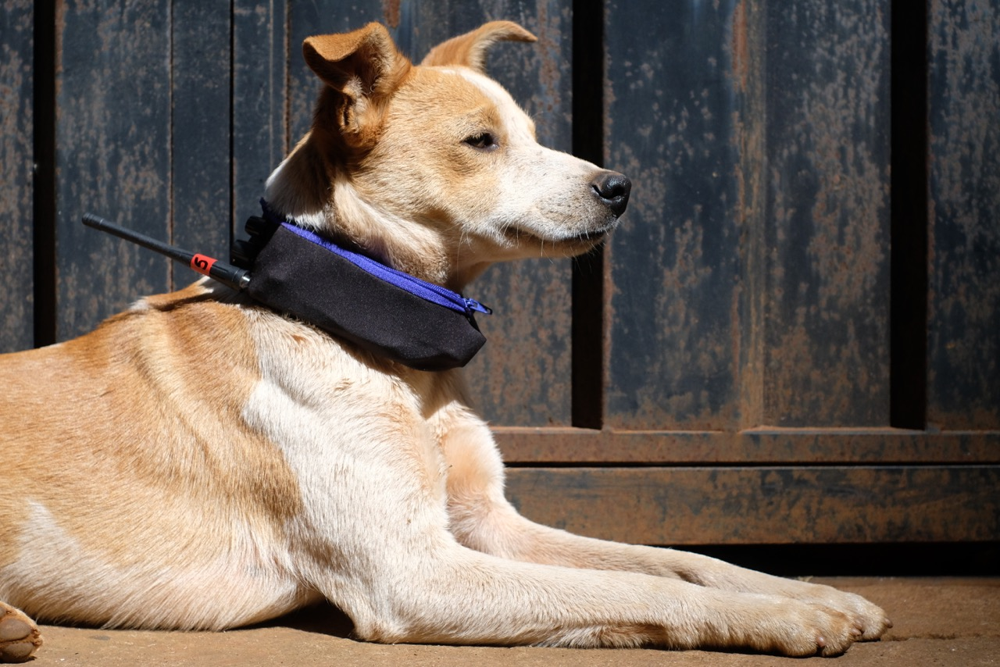

  

A soundscape listening of Jardim Canadá (MG, Brazil) from the sonorous perspective of the neighborhood's mutt dogs.

Radio transmitter collars were created and were capable of transmit through FM | UHF, the sound environment of the dogs that carried them.

From a mobile station FM radio receiver, it was possible to tune to each of the dogs and listen to them in real time, passing from one dog to another, combining their sounds and audibly drawing the choreography of the packs of the region.

 

---

 

['O CÃO E A CIDADE'](http://www.jaca.center/o-cao-e-a-cidade-2/){:target="_blank"} _ DANIEL TOLEDO'S TEXT

 

---

