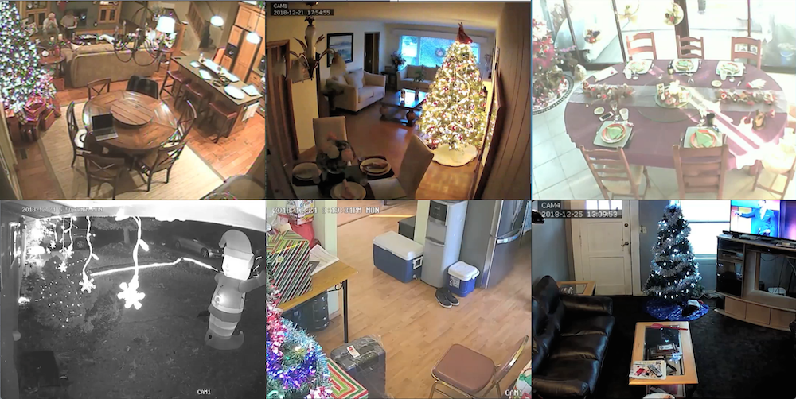

  

Na sala de uma casa em Tel Aviv, uma senhora posiciona alguns enfeites em sua mesa. Ao mesmo tempo, em Bangkok, uma família se reúne para o jantar. Em Houston, um homem passa a tarde embrulhando presentes e em Coux, na França, uma ceia interminável é servida para poucos. Todas estas cenas estão visíveis na Internet, gravadas por câmeras de segurança IP utilizadas por moradores para monitorar seus espaços privados. Tive acesso a essas imagens utilizando senhas padrão estabelecidas pelos fabricantes dessas câmaras, que muitas vezes, por negligência de seus usuários, nunca foram alteradas e, em geral, são muito simples: "12345" ou ø.					

Durante dezembro 2018 me aproveitei dessa brecha para observar casas do mundo inteiro. Pessoas solitárias ou famílias inteiras reunidas para comemorar ou passar, corriqueiramente, o dia do natal.

 
