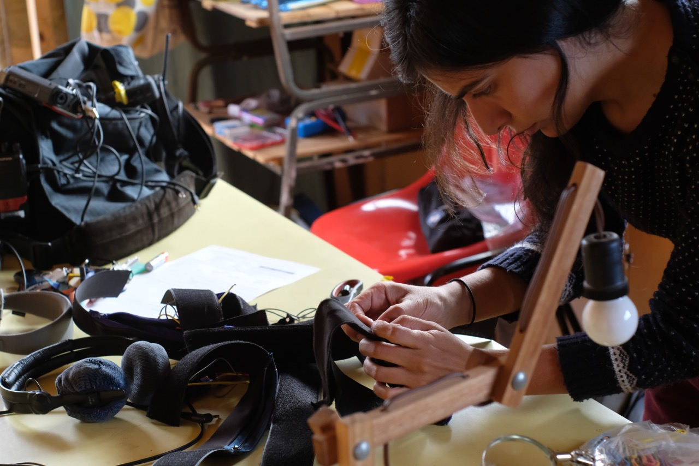
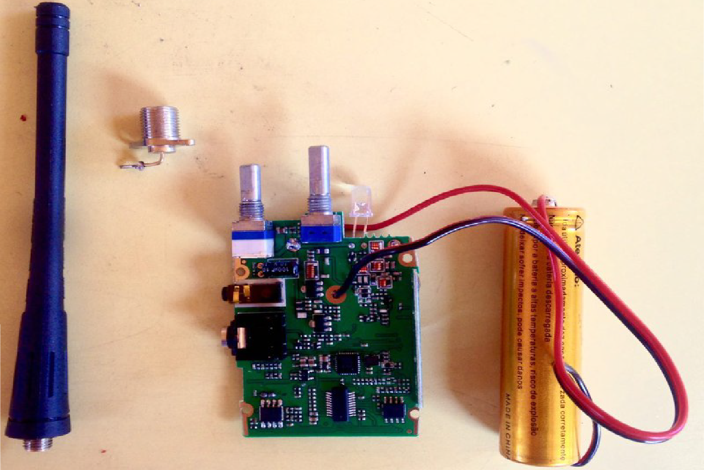
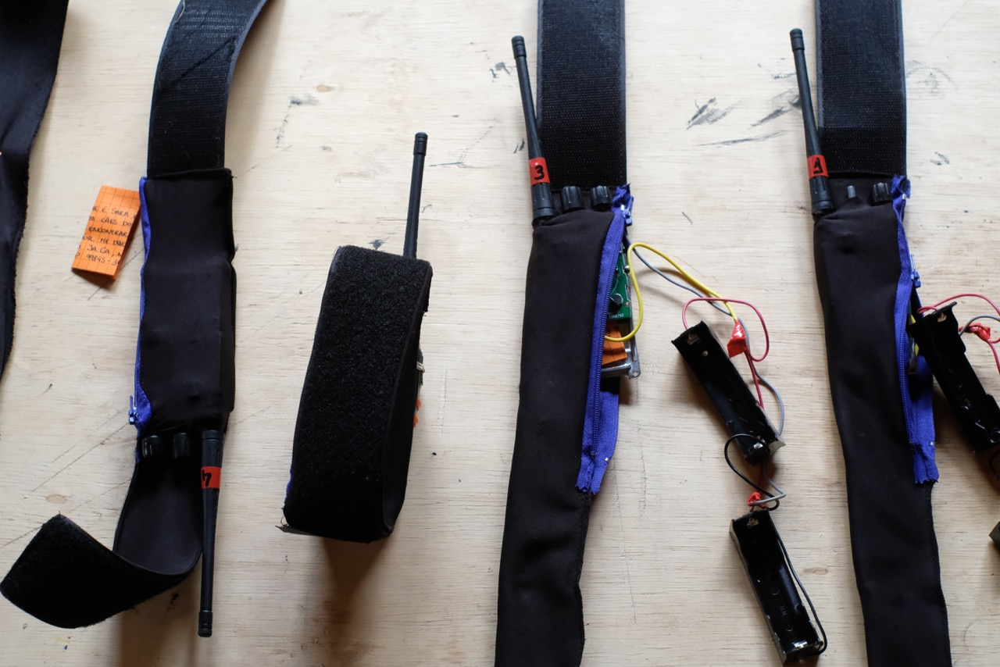
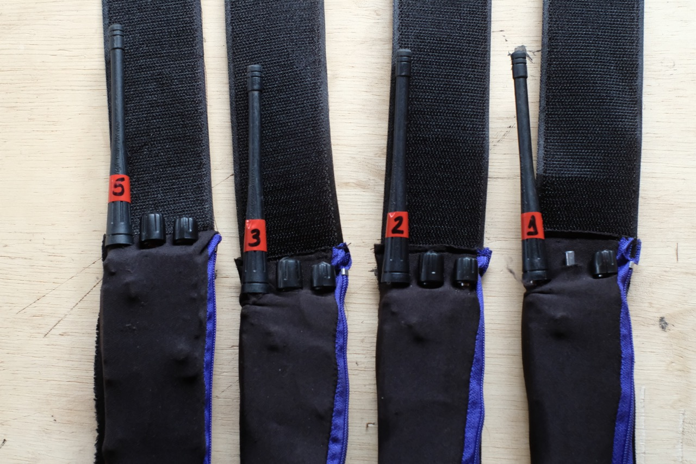

  

My proposal is to create a radio to record and transmit sounds captured by animals of Wave Farm and its neighborhoods, allowing a listening from the auditory perspective of other species.

The collected sounds will be captured in a spatialized way, following the movement of the animals. The idea is to use multiple transmitters simultaneously, making it possible to tune to each of the animals and listen to them in real time, passing from one to another, combining their sounds and drawing a sound choreography in the region.

These animals could be dogs (saw on instagram Dash and Ivy, could be then, if they agree), caws, pigs, horses of neighboring farms, or even deers from the Catskill Mountain Park.  This will depend on creating a close relationship with them over the 10 days of residence.

This was done previously with mutt dogs in Brazil during the project [matilha](../matilha){:target="_blank"}. As the next stage of the project, I propose that the sounds transmitted by the animals, will be combined, mixed in real time and re-transmitted on the Wave Farm's WGXC 90.7-FM radio. It is a project with two radio transmission layers: the 1st layer is a UHF transmission from the animals to the receiving station, where the sounds will be mixed in real time. The other radio layer is the result of this combination of sounds that will be transmitted on the WaveFarm radio.

The announcers and field recorders are the animals, I will only be the technician that will make the combination and retransmission of this material.

 

---

  

### radio transmission collars

For the capture and transmission of animal sounds, I will use collars equipped with microphones and FM transmitters. (see photos on the website)

 

  

    
  

  

    
  

 

  

    
  

  

    
  

 

These collars were created in the first moment, with the mutt dogs, when I learned to reprogram and hack walkie talkies, optimize batteries, and to interpret sound content of another scale (simple noises, often brought me location information). It is important to highlight here, that the circuit is a light and compact piece.

The transmitters were removed from powerful walkie talkies, reprogrammed for just transmit and for operation in different frequency bands (within the range reserved by the United States Radio Spectrum Frequency Allocation Chart for the operation of walkie-talkies and handheld transceiver) .

Depending on the animals collaborating on this project, some functions can be added to the collars: solar charger or gps. In the case of wild animals, the gps could release the transmitter collar automatically, if the animal deviates from a pre-established radius.

 

---

 

### Artist Statement
  

I am a 33-year-old Brazilian artist and developer. I studied mathematics and electrical engineering at the Federal University of Minas Gerais. In my projects, situated at the confluence of art, science and technology, I use multiple supports, above all sound, electronics and video. Drawing and illustration also are present in all my creative processes.
 
  
Generally speaking, my work deals with the contradictions of a society at the same time based and alienated on technology. In this context, I create technological disalienation tactics. I also propose, in my projects, a reflection on the role of animals that share spaces with us. In collaboration with other species, I seek to stimulate the search for more balanced biological-technological relations.

 

---

  
 

Here some tests I did with the collars radio trasmitters:
  
