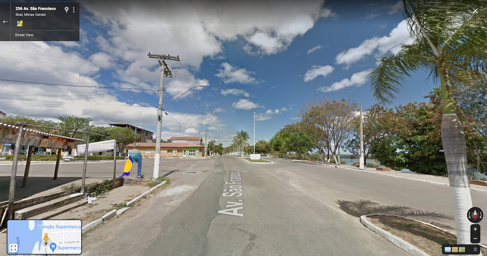

LISTEN TO THE SOUND PIECE ON [FESTIVAL SERES RIOS](https://seresrios.org){:target="_blank"} FROM 2 TO 8 AUGUST 2021

   

Orelhinha is a sound piece created from calls made to public telephones on the banks of the São Francisco and Jequitinhonha rivers.

A series of calls to recipients hitherto unknown or even non-existent. Crossed lines in an attempt to hear the life that goes on around the rivers.

While they are at risk of extinction in much of the state, public telephones are still the only means of communication in riverside villages that do not have mobile phone coverage.

The phones were found traveling along the banks of these rivers using maps with panoramic views of public spaces and with satellite images. The number of each phone was retrieved by crossing its coordinates identified on the route with information collected in the database of the Brazilian National Telecommunications Agency.
  

---

 

**With:** Vitor, Sueli, Manuel, João, Elias, Ricardo, Valdir, Adenides, Adel, Uelma, Marcos, Gabriel, Neurisvânia, João, Enrico, Débora, Gianetti, Fernando, Juarez, Luciana, Karine, Zé Nilson, João Victor e todos outros que atenderam os orelhões nas escolas rurais e hospitais municipais.

**Curatorship:** Bernardo Esteves, Júnia Torres, Marcela Bertelli e Wellinhton Cançado

**With support of:** [JA.CA](https://www.jaca.center/){:target="_blank"} – Francisa Caporalli, Samanta Moreira, Mateus Mesquita

**Tilesets:** Tiago Esteves

  

---

 

  

---
