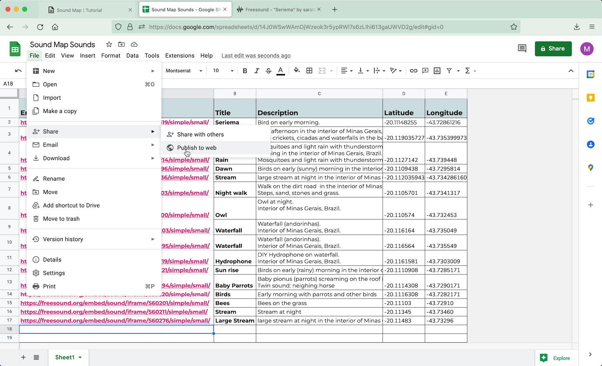

<iframe src="https://youtube.com/embed/5RfPWc047o8" frameborder="0" allow="accelerometer; autoplay; clipboard-write; encrypted-media; gyroscope; picture-in-picture" allowfullscreen></iframe>

  

> <b>Platforms:</b> 
         1. [uMap](http://umap.openstreetmap.fr/en/){:target="_blank"}  
         2. [freesound](https://www.freesound.org/){:target="_blank"}  
         3. [Google Sheets](https://docs.google.com/spreadsheets/){:target="_blank"}  
  

---

 
  
## step 1: Upload your sounds to a cloud, repository or streaming platform

 

 

* In this tuttorial we will build the map with sounds published on [freesound.org](https://www.freesound.org/){:target="_blank"} 

  

---
 
  
## step 2: Create a google spreadsheet with your sounds 

 

  

     
   

    

        
    

 

* It is important that the spreadsheet has two columns named as "Latitude" and "Longitude"

* The coordinates must be in **DECIMAL DEGREE SYSTEM**
> ex.: -20.11148255	-43.72861216

* Another column must contain a link to the embed link for your sounds.

* You should not use all the embed code, but only the link shown in quotes aftes "src="
 
> As an example, in the case of freesound the embed code is  
> <b><em><iframe frameborder="0" scrolling="no" src="</em><em style="background-color:#ffdf3b;">https://freesound.org/embed/sound/iframe/560319/simple/small/</em><em>"width="375" height="30"></iframe></em></b>
  
> And the link that will be added to the spreadsheet is
 
> <b><em style="background-color:#ffdf3b;">https://freesound.org/embed/sound/iframe/560319/simple/small/</em></b>

  

---
 
  
## step 3: configure the spreadsheet cells

 

 

* The cells format must be set as Plain Text. To configure it, select all the cells and click on:
> <b>>Format >Number >Plain text</b>
  
  

---

 
  
## step 4: publish your spreadsheet on web

 

  

     
   

    

        
    

 

* Publish your spreadsheet on web. Click on:
> <b>>File >Share >Publish to web</b>

* Select the tab (in the example "Sheet1") and select **.csv** as output format. 
  
  

---

 
  
## step 5: create and style your map on uMap

 

  

     
   

    

        
    

 

* Go to [uMap](http://umap.openstreetmap.fr/en/){:target="_blank"}  

* And click on **"Create a Map"**
 

* Style and center it as you want
  
  

---

 
  
## step 6: insert remote data

 

  

     
         
      
       
        
   

    

        
         
        
         
        
    

 

* Enter edition mode clicking on the pencil icon

* Select the layer icon

* Click on **Remote Data**

* In **URL** field, paste the link of your spreadsheet published on web as csv

* In **FORMAT** field, select csv

* And set **DYNAMIC** on, to fetch data each time the sheet is updated

* Save and reload your page. All the markers should appear.
  
  

---

 
  
## step 7: configure popups with audio players

 

  

     
   

    

        
    

 

* Enter again, in the Layer edition mode 

* Click on **Interaction Options**

* Fill it with the columns names of your sheet following text formatting of uMap.
> tip.: Check all the formatting options clicking on <b>?</b> icon 

* Be sure that the names are written exactly as in the spreadsheet

 

 

* Save and reload your page.
  
  

--- 

 

Other links:

* [Sound maps I already developped](https://saralana.xyz/my-maps){:target="_blank"}  

* [MAPBOX SHEETMAPPER](https://www.mapbox.com/impact-tools/sheet-mapper){:target="_blank"} 

Sound maps I love:

* [aporee](https://aporee.org/maps/){:target="_blank"}  

* [sp sound map](http://www.spsoundmap.com/){:target="_blank"} 

* [cities and memory](https://citiesandmemory.com/){:target="_blank"} 

* [audiomapa](https://www.audiomapa.org/){:target="_blank"} 

 
 

I would love to see your maps!
Please share it with me :)
Contact:
  
[https://saralana.xyz/about](https://saralana.xyz/about){:target="_blank"}