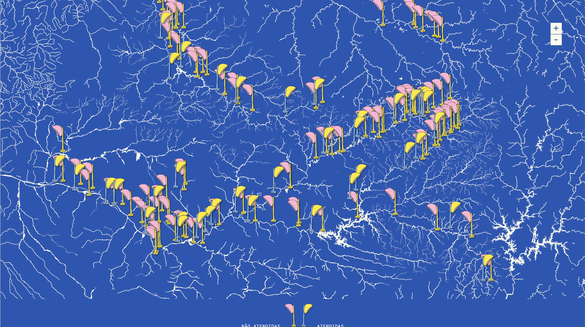
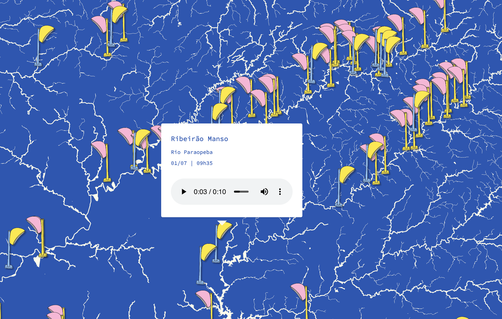

Mapa sonoro para meu projeto [Orelhinha](../orelhinha){:target="_blank"}.

O mapa apresenta um mapeamento de orelhões à beira dos rios São Francisco e Jequitinhonha, com trechos de chamadas realizadas para esses dispositivos.

A base utilizada é o mapa hidrográfico de Minas Gerais. 

Acesse [aqui](../mapa-orelhinha){:target="_blank"} o mapa sonoro.
  

  

  

  

