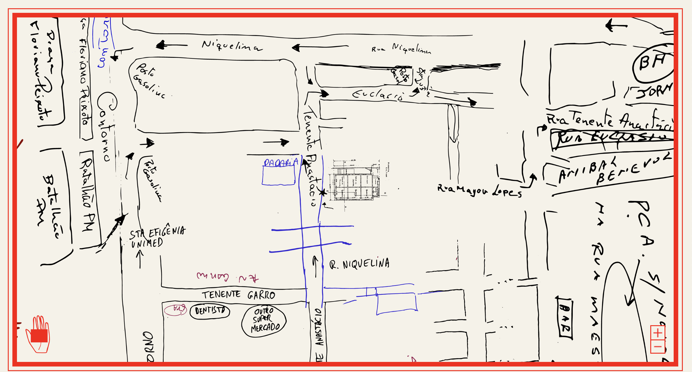
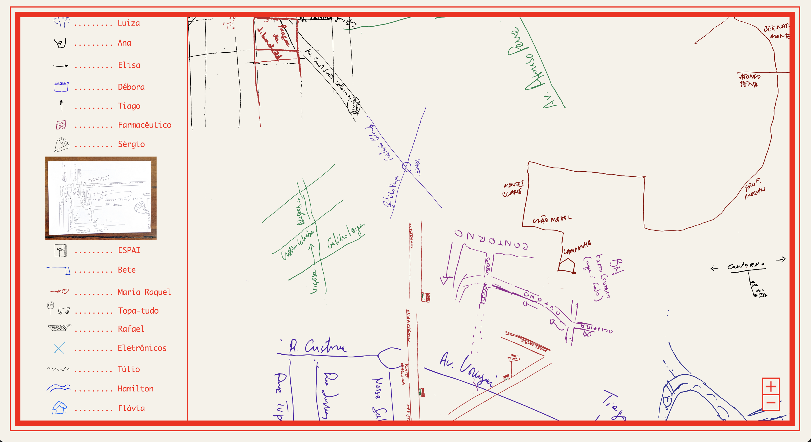
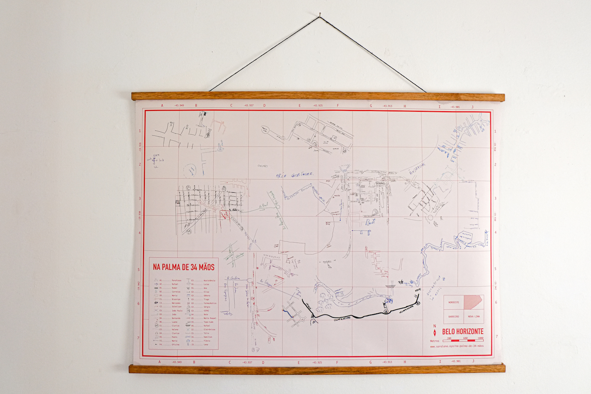
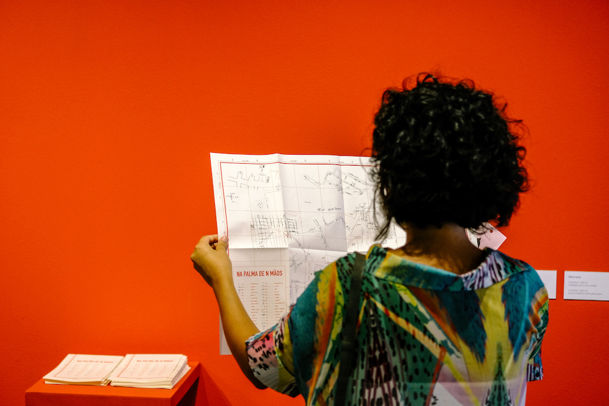

Map created from a collage of hand-drawn maps.

The maps, collected during my project [On the Palm of n Hands](../en/na-palma){:target="_blank"}, are digitized and vectorized. Subsequently, a digital collage is created, approximately respecting the scales and geographic coordinates of the streets, squares and other places drawn.

The interactive map allows you to zoom in on each drawing or view the entire map.
here.

Access the interactive map [here](../na-palma-de-n-maos){:target="_blank"}.
  

## VERSÃO DIGITAL:

  

  

  

## VERSÃO IMPRESSA:

  

  
  

