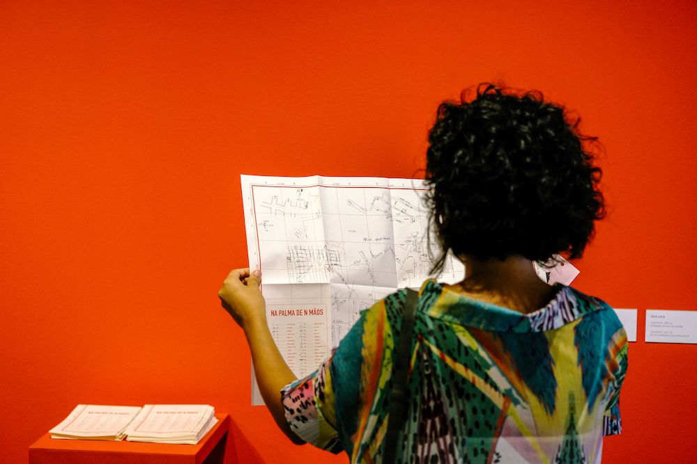

Mapa criado a partir da colagem de mapas desenhados à mão. 
  
Os mapas, coletados durante meu projeto [Na Palma de n Mãos](../na-palma){:target="_blank"}, são digitalizados e vetorizados. Posteriormente é realizada uma colagem digital respeitando de maneira aproximada as escalas e coordenadas geográficas das ruas, praças e outros lugares desenhados.

O mapa interativo, permite fazer um zoom em cada desenho ou visualizar o mapa completo.

Acesse [aqui](../na-palma-de-n-maos){:target="_blank"} o mapa interativo.
  

## VERSÃO DIGITAL:

  

  

  

## VERSÃO IMPRESSA:

  

  
  

