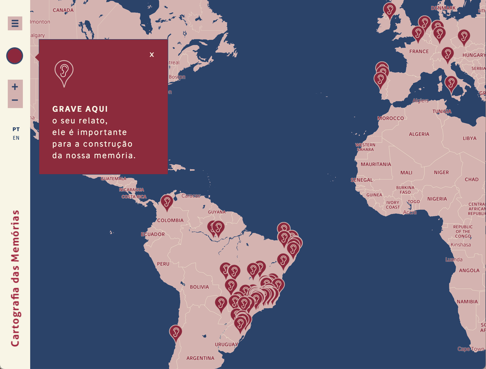
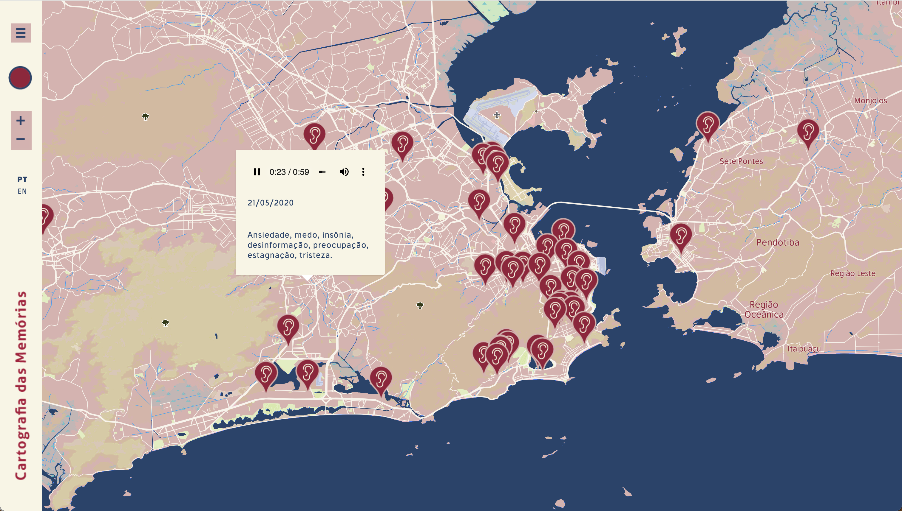

Mapa sonoro desenvolvido para o projeto Cartografia das Memórias, uma iniciativa colaborativa que buscou registrar e preservar, através de relatos orais, memórias de vivências pessoais durante a pandemia da Covid-19, iniciada em 2020. 

Acesse [aqui](https://cartografiadasmemorias.org/en.html){:target="_blank"} o mapa sonoro.

  

  

  

**Identidade visual e o design da página web:** Clarice G. Lacerda

**Desenho do mapa:** Keila Zaché e Sara Lana

**Desenvolvimento do mapa:** Sara Lana

**Desenvolvimento do site:** Vitor Januário e Sara Lana
  
  

