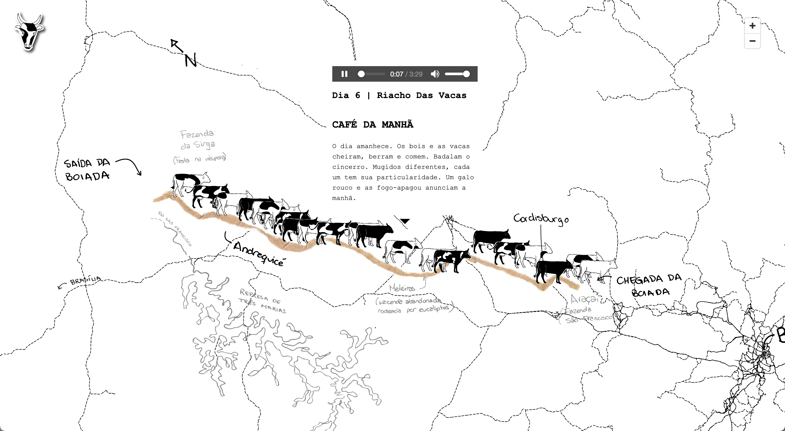
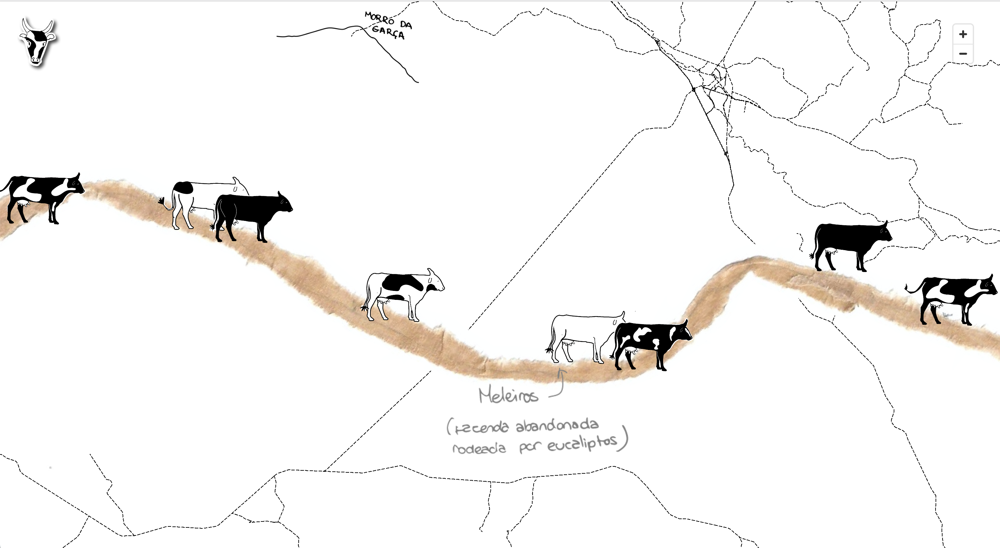
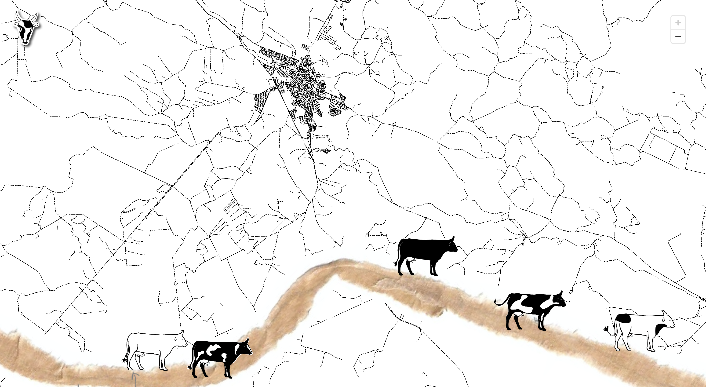

Mapa sonoro para meu projeto [Diário Sonoro do Sertão](../diario-sonoro){:target="_blank"}.

O mapa apresenta o trajeto no sertão mineiro realizado pelo escritor Guimarães Rosa, e descrito em seu diário de viagem, A Boiada (1952).

70 Anos depois, percorri o mesmo trajeto, gravando os sons de cada lugar descrito por ele. 

O desenho do mapa foi realizado mesclando ilustrações, colagens e anotações.

Um traçado pontilhado foi projetado sobre trama rodoviária da região.

Acesse [aqui](../diario-sonoro-sertao){:target="_blank"} o mapa sonoro.

  

  

  

  

