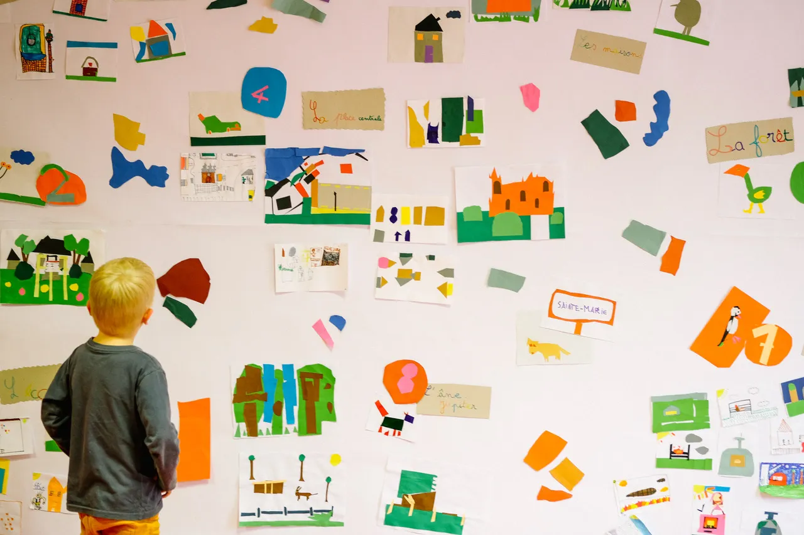
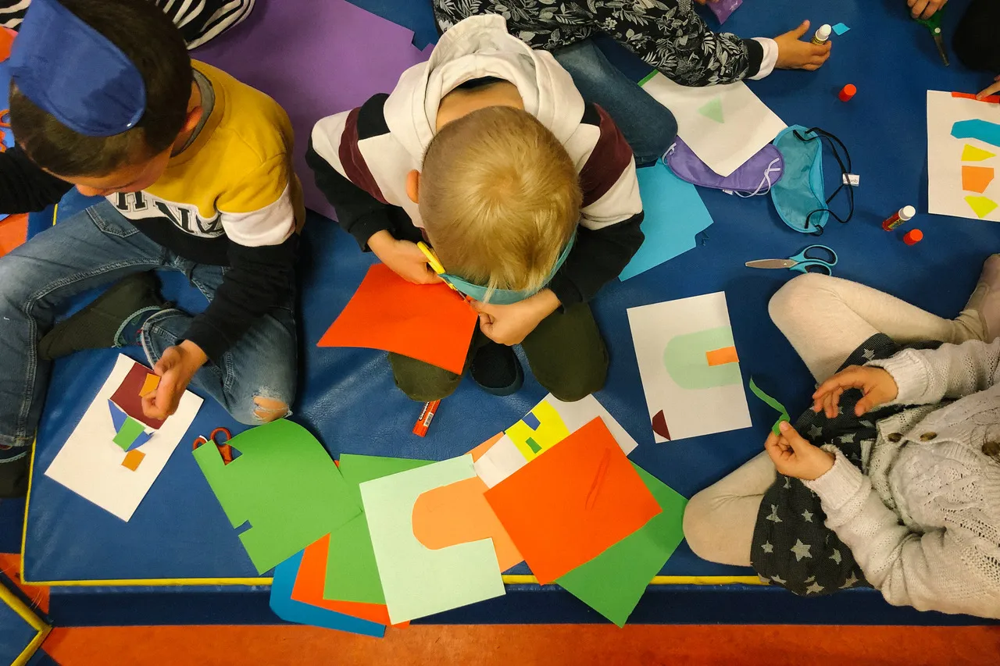
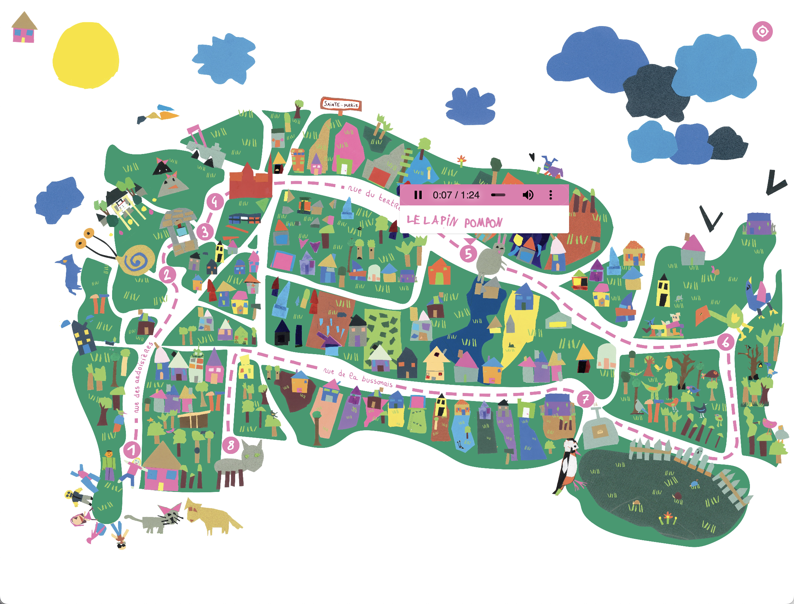
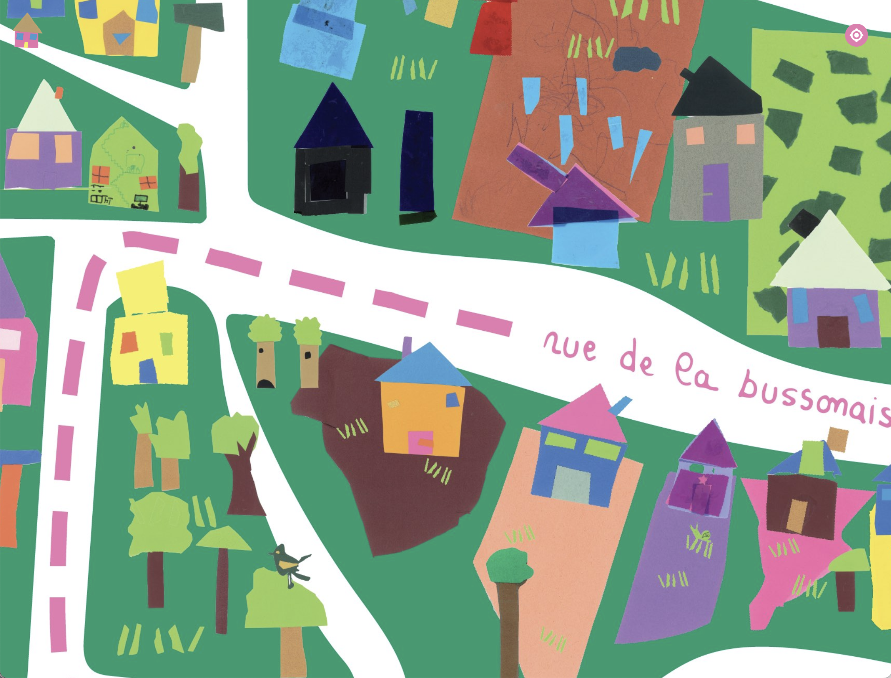
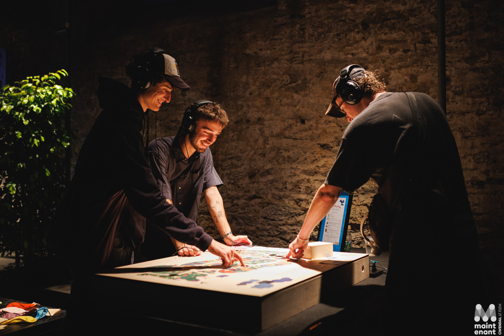

Mapa sonoro para meu projeto [Les Sons Perdus](https://felixblume.com/sonsperdus/){:target="_blank"} do artista Félix Blume.

Durante o projeto, crianças fizeram colagens em papel, representando casas, bosques e outros lugares da cidade.

As colagens foram vetorizadas e, a partir delas, um mapa da cidade foi criado respeitando a escala e coordenadas geográficas da cidade.

A tipografia do mapa foi criada a partir de textos escritos à mão pelas crianças participantes do projeto.

O mapa apresenta um rastreador, que possibilita indicar sua localização para percorrer o trajeto sinalizado e escutá-lo presencialmente.

Acesse [aqui](https://felixblume.com/lessonsperdus-carte.html){:target="_blank"} o mapa sonoro.

  

  

  

  

  

  

