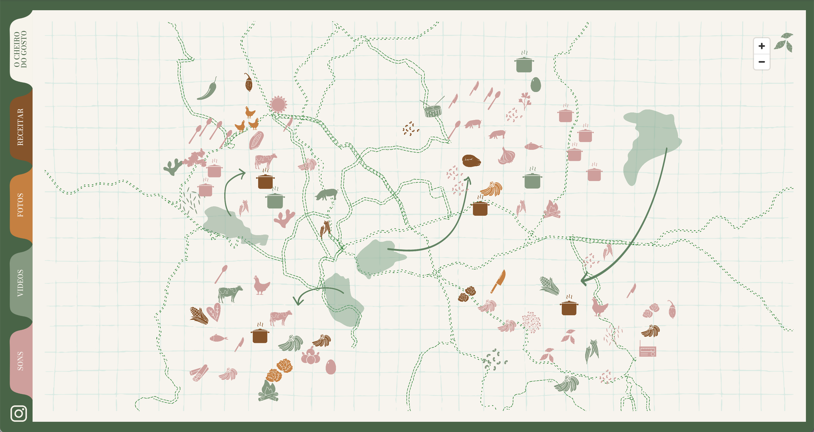
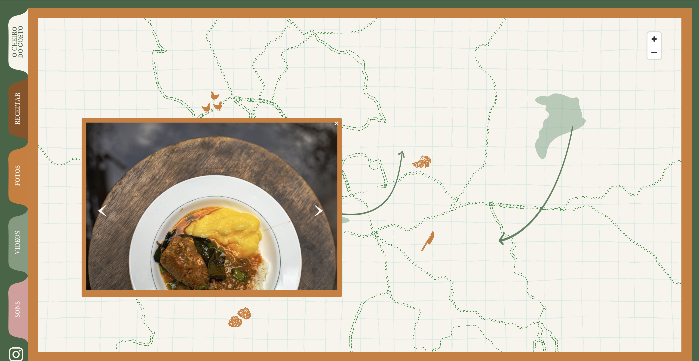
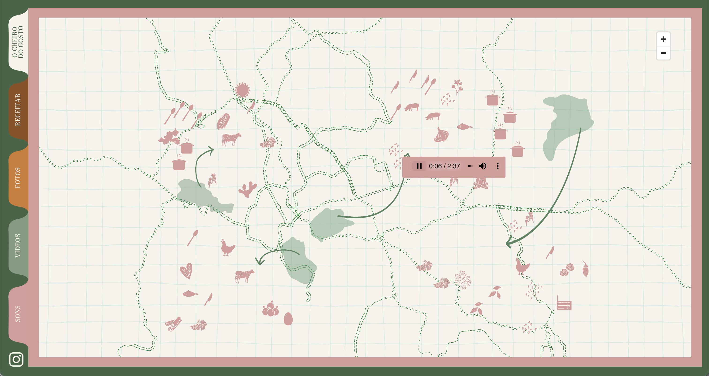
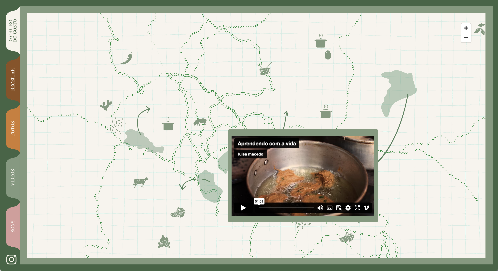

Mapa interativo para meu projeto [O Cheiro do Gosto](https://ocheirodogosto.com.br/){:target="_blank"} da artista Luísa Macedo.

Um mapa de quintais de Belo Horizonte, com diversos conteúdos de áudio, fotos, textos e vídeos.

O mapa apresenta filtros que separam o tipo de mídia.

  

  

  

  

  

