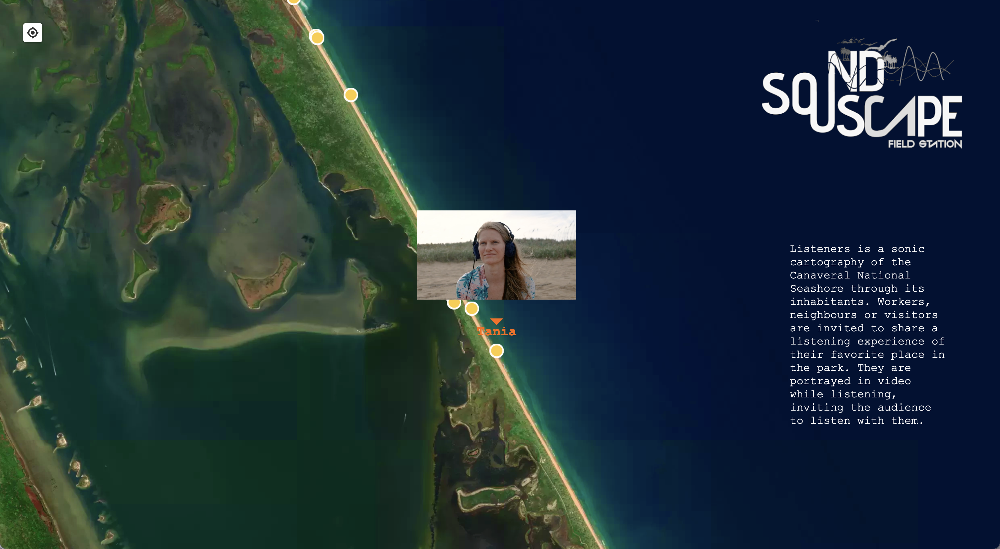

Sound map developped for the Listeners project, produced by the  ACA Soundscape Field Station at Canaveral National Seashore and jointly managed by Atlantic Center for the Arts and Canaveral National Seashore.

Click [here](https://felixblume.com/acasoundscapemap.html){:target="_blank"} to access the map.

  

  

  

  

