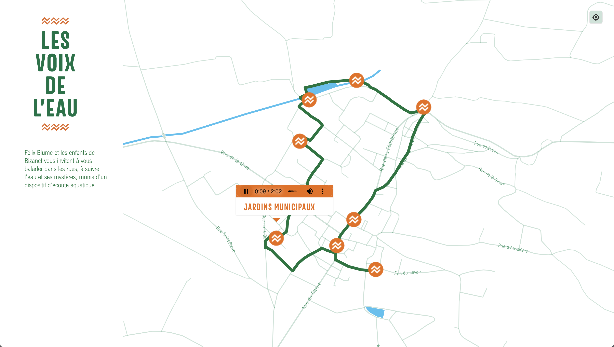

Sound map created for the project [Les Voix de l'Eau](https://felixblume.com/lesvoixdeleau/){:target="_blank"} produced by the Parc naturel régional de la Narbonnaise en Méditerranée, with the collaboration of the Mairie de Bizanet and support from DRAC Occitanie.

The map has a geolocate feature: a button that the user can press to share their current device location and see that location marked on the map.

So, it is possible to follow the route and listenning to the sounds.

The sound map [link](https://felixblume.com/lesvoixdeleau-carte.html){:target="_blank"}.

  

  

  

  
