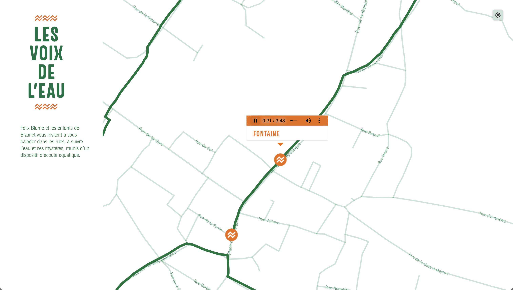

Mapa sonoro desenvolvido para o projeto [Les Voix de l'Eau](https://felixblume.com/lesvoixdeleau/){:target="_blank"} produzido pelo Parc naturel régional de la Narbonnaise en Méditerranée, com a collaboration da Mairie de Bizanet e apoio da DRAC Occitanie.

O mapa apresenta um rastreador, que possibilita indicar sua localização para percorrer o trajeto sinalizado e escutá-lo presencialmente.

Acesse [aqui](https://felixblume.com/lesvoixdeleau-carte.html){:target="_blank"} o mapa sonoro.

  

  

  

  
